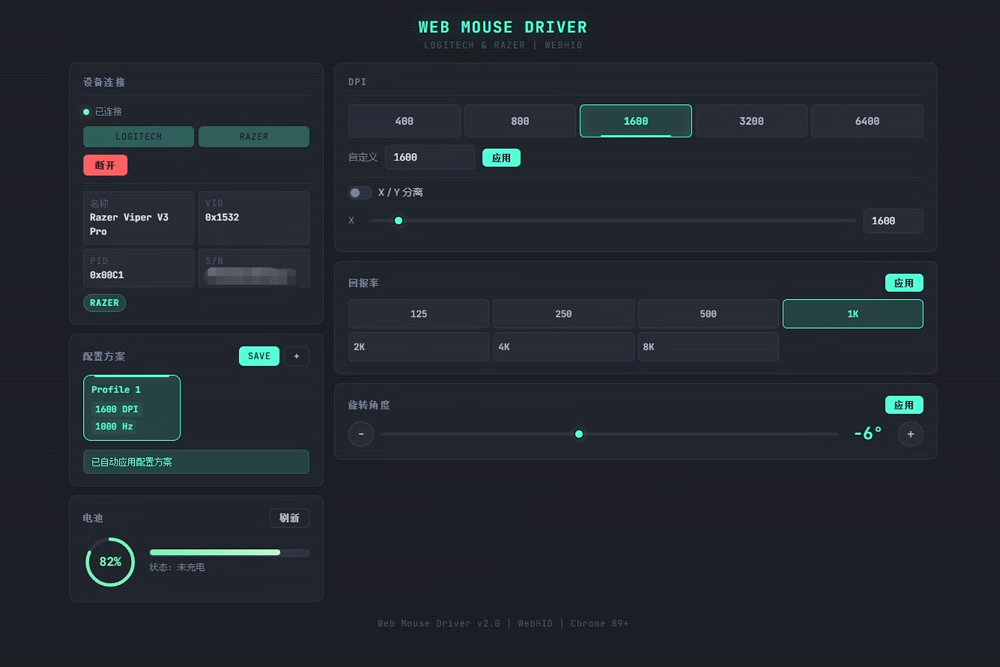
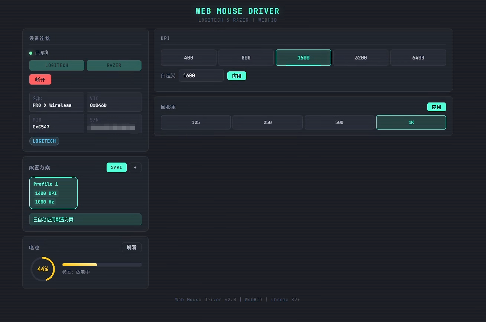

### Web Mouse Driver

Browser-based mouse driver via WebHID. No software installation required.

**Demo: https://mouse.wwwneo.com**

#### Supported Devices

| Brand | Device | Features |
|-------|--------|----------|
| Logitech | PRO X SUPERLIGHT | DPI, Polling Rate, Battery |
| Razer | Viper V3 Pro | DPI (X/Y), Polling Rate (up to 8000Hz), Battery, Rotation |

#### Screenshots

| Razer Viper V3 Pro | Logitech PRO X Wireless |
|---|---|
|  |  |

#### Features

- Auto-detect device brand by Vendor ID
- Multi-profile config per device serial number
- Real-time battery monitoring (60s polling)
- Auto-apply saved config on reconnect
- Server-side config persistence

#### Tech Stack

- WebHID API (Chrome 89+ / Edge 89+)
- Logitech HID++ 2.0 protocol
- Razer 90-byte feature report protocol
- Docker + Nginx deployment

#### Usage

Open https://mouse.wwwneo.com → Click connect → Select your mouse → Done.
